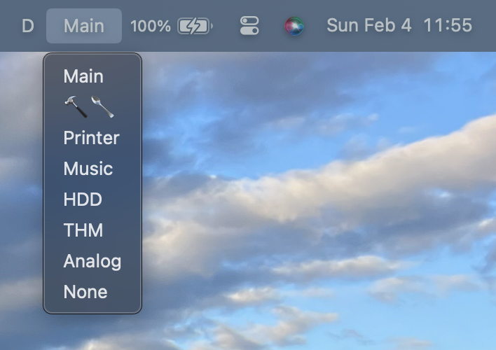
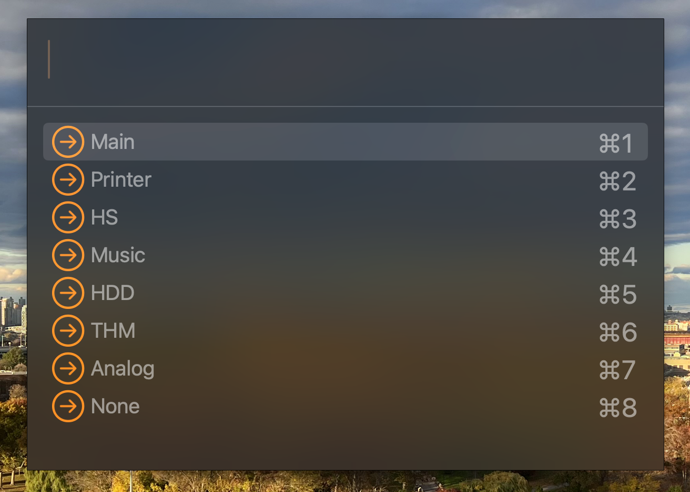

# Spacer.spoon
Spacer is an expansion pack for macOS's native "Mission Control" Space manager that adds new functionality.

At the core, Spacer is a Menu Bar item which displays the current Space's "Name" and provides a menu for switching between Spaces quickly:



Additionally, a hotkey can be bound (`space_chooser`) which will toggle a Spotlight-like completion panel for switching to Spaces by name:



# Features

* Spaces are enumerated by their position in Mission Control from left-to-right
* All new or unnamed Spaces default to the name "None"
* Spaces can be renamed by holding Alt when clicking on a Space in the menu
* When a space is moved in Mission Control, its position will be updated in the menu
* Space names are persisted left-to-right in Hammerspoon settings between loads

# Installation

## Automated

Spacer can be automatically installed from my [Spoon Repository](https://github.com/adammillerio/Spoons) via [SpoonInstall](https://www.hammerspoon.org/Spoons/SpoonInstall.html). See the repository README or the SpoonInstall docs for more information.

Example `init.lua` configuration which configures `SpoonInstall` and uses it to install and start Spacer, also binding the Chooser to the default hotkey (Ctrl+Space):

```lua
hs.loadSpoon("SpoonInstall")

spoon.SpoonInstall.repos.adammillerio = {
    url = "https://github.com/adammillerio/Spoons",
    desc = "adammillerio Personal Spoon repository",
    branch = "main"
}

spoon.SpoonInstall:andUse("Spacer", {
    repo = "adammillerio",
    start = true,
    hotkeys = "default"
})
```

## Manual

Download the latest release from [here.](https://github.com/adammillerio/Spoons/raw/main/Spoons/Spacer.spoon.zip)

Unzip and either double click to load the Spoon or place the contents manually in `~/.hammerspoon/Spoons`

Then load the Spoon in `~/.hammerspoon/init.lua`:

```lua
hs.loadSpoon("Spacer")
```
Optionally, the chooser can also be bound to a hotkey, such as Ctrl+Space:

```lua
spoon.Spacer:bindHotkeys({space_chooser = {{"ctrl"}, "space"}})
```

# Usage

Refer to the [hosted documentation](https://adammiller.io/Spoons/Spacer.html) additional for information on usage.
